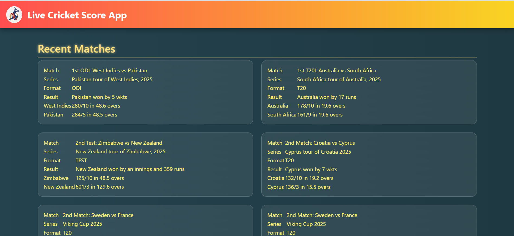
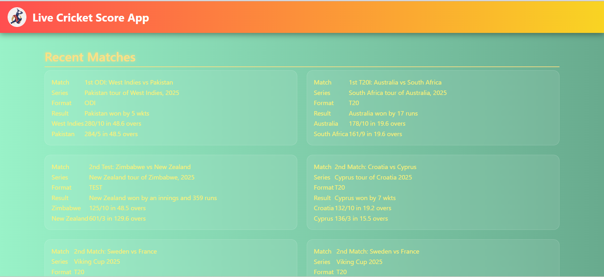

# Live Cricket Score App

A simple and interactive web application to get **live cricket scores** and match updates in real-time. Built using Python, JavaScript, HTML/CSS, and Bootstrap.

---

## Features

- Get **live cricket scores** for ongoing matches  
- Display **upcoming matches** and team information  
- **Responsive design** for both desktop and mobile devices  
- Easy to use and lightweight  

---

## Screenshots

  
  

*Add your own screenshots in a `screenshots` folder for better visualization.*

---

## Installation

1. **Clone the repository**
```bash
git clone https://github.com/Manikantareddy4567/Live-Cricket_Score-App.git
cd Live-Cricket_Score-App
