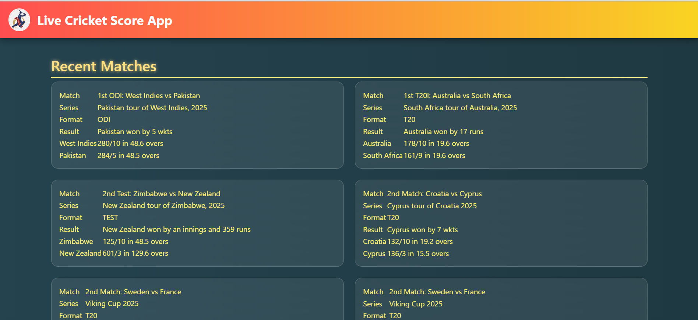
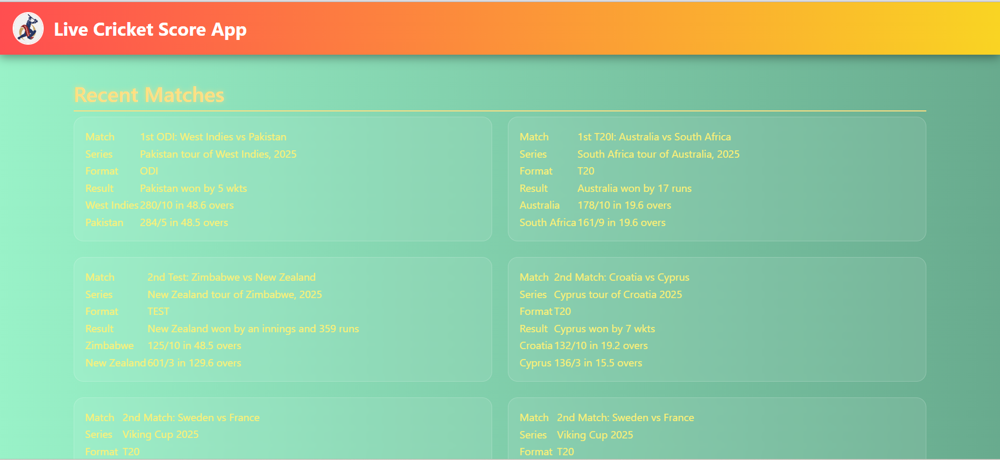

# Live Cricket Score App

A simple and interactive web application to get **live cricket scores** and match updates in real-time. Built using Python, JavaScript, HTML/CSS, and Bootstrap.

---

## Features

- Get **live cricket scores** for ongoing matches.  
- Display **upcoming matches** and team information.  
- **Responsive design** for both desktop and mobile devices.  
- Easy to use and lightweight.

---

## Screenshots

  
  


*(Add your own screenshots in a `screenshots` folder for better visualization)*

---

## Installation

1. **Clone the repository**
```bash
git clone https://github.com/Manikantareddy4567/Live-Cricket_Score-App.git
cd Live-Cricket_Score-App
Create a virtual environment (optional but recommended)

bash
Copy
Edit
python -m venv venv
Activate the virtual environment

Windows:

bash
Copy
Edit
venv\Scripts\activate
macOS/Linux:

bash
Copy
Edit
source venv/bin/activate
Install dependencies

bash
Copy
Edit
pip install -r requirements.txt
Usage
Run the app:

bash
Copy
Edit
python app.py
Open your browser and go to:

cpp
Copy
Edit
http://127.0.0.1:5000
Enjoy live cricket updates!

Contributing
Contributions are welcome!

Fork the repository

Create a new branch: git checkout -b feature/your-feature

Commit your changes: git commit -m "Add some feature"

Push to the branch: git push origin feature/your-feature

Create a Pull Request

License
This project is licensed under the MIT License. See the LICENSE file for details.

Contact
GitHub: Manikantareddy4567

Email: your-email@example.com

yaml
Copy
Edit

---

I can also make a **more attractive version with badges, GIF previews, and color styling** for your GitHub page so it looks professional.  

Do you want me to do that?


You said:
create copy paste full readme text


ChatGPT said:
Here’s a complete, copy-paste-ready README.md for your Live-Cricket_Score-App project:

markdown
Copy
Edit
# Live Cricket Score App

A simple and interactive web application to get **live cricket scores** and match updates in real-time. Built using Python, JavaScript, HTML/CSS, and Bootstrap.

---

## Features

- Get **live cricket scores** for ongoing matches  
- Display **upcoming matches** and team information  
- **Responsive design** for both desktop and mobile devices  
- Easy to use and lightweight  

---

## Screenshots

  
  

*Add your own screenshots in a `screenshots` folder for better visualization.*

---

## Installation

1. **Clone the repository**
```bash
git clone https://github.com/Manikantareddy4567/Live-Cricket_Score-App.git
cd Live-Cricket_Score-App
Create a virtual environment (optional but recommended)

bash
Copy
Edit
python -m venv venv
Activate the virtual environment

Windows

bash
Copy
Edit
venv\Scripts\activate
macOS/Linux

bash
Copy
Edit
source venv/bin/activate
Install dependencies

bash
Copy
Edit
pip install -r requirements.txt
Usage
Run the app:

bash
Copy
Edit
python app.py
Open your browser and go to:

cpp
Copy
Edit
http://127.0.0.1:5000
Enjoy live cricket updates!

Contributing
Contributions are welcome!

Fork the repository

Create a new branch: git checkout -b feature/your-feature

Commit your changes: git commit -m "Add some feature"

Push to the branch: git push origin feature/your-feature

Create a Pull Request
